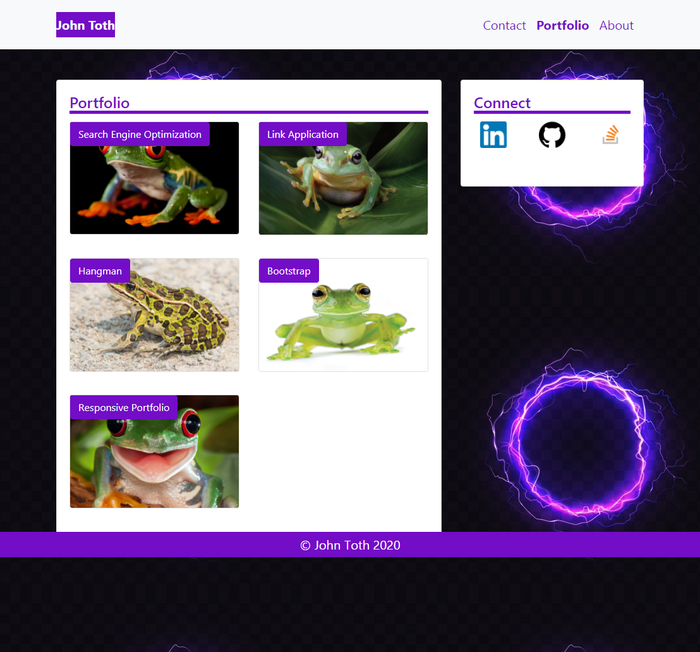

# Responsive Portfolio

#### By John Toth

## Description

This project demonstrates building out 3 separate web pages utilizing Bootstrap components.  I utilized a grid, navbar and card components to structure the portfolio pages.  Intent was also to make the pages and images responsive when web browser is resized or utilized on a mobile device.  Style sheet contains custom styling elements to override default Bootstrap classes in certain instances.  Aria tags were added to the Contact page html for accesibility.

The menu options toggle to an icon as the screen grows smaller.   The menu option links take user to appropriate page.  The Contact page Submit button is not intended to work at this time.   However, the fields are validated for correct format of data on the form.  On the Portfolio page, only the Search Engine Optimization and Responsive Portfolio buttons work.   (There are not enough projects to link to yet in my GitHub).

There is a sidebar that is consistent across all pages that provide Connection icons.   These links open new pages to either my GitHub, StackOverflow or LinkedIn pages.

## Screenshot

The following is a picture of the About (Home) page for the responsive portfolio.

  

The following is a picture of the Contact page for the responsive portfolio.

  

The following is a picture of the Portfolio page for the responsive portfolio.

  

## Setup/Installation Requirements

Direct link to repository:  https://github.com/jtoth7824/responsivePortfolio

Direct link to Code Refactor webpage:  https://jtoth7824.github.io/responsivePortfolio/

## Support and contact details

Please email me for further questions at jtoth7824@gmail.com

## Technologies Used

HTML
CSS
Bootstrap Grid
Responsive images